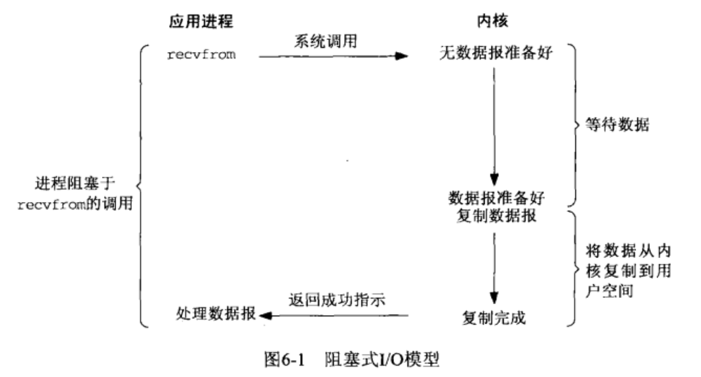
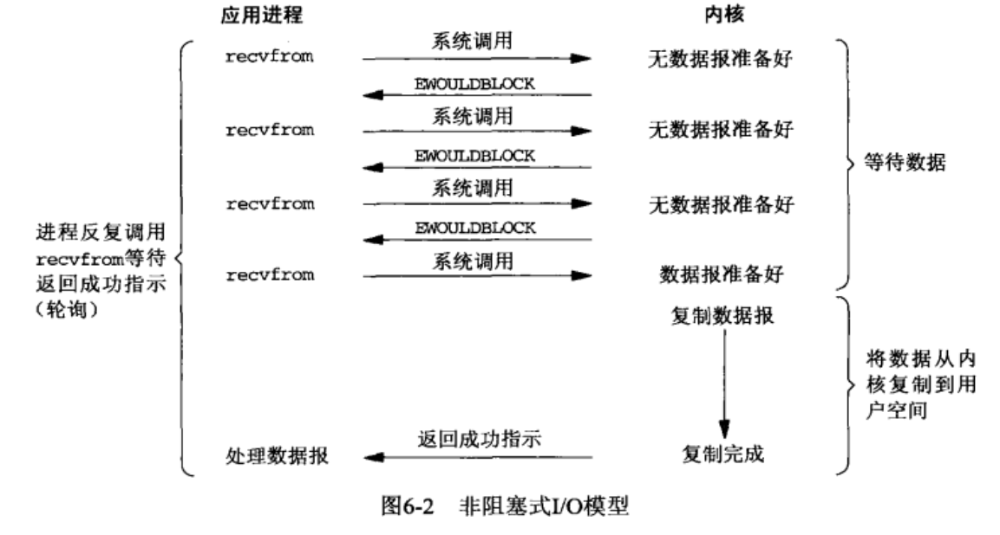
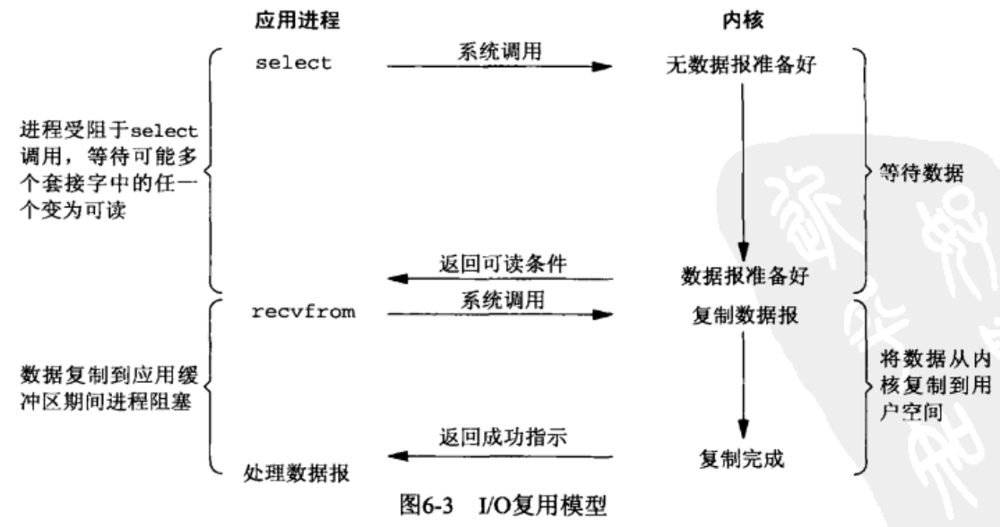
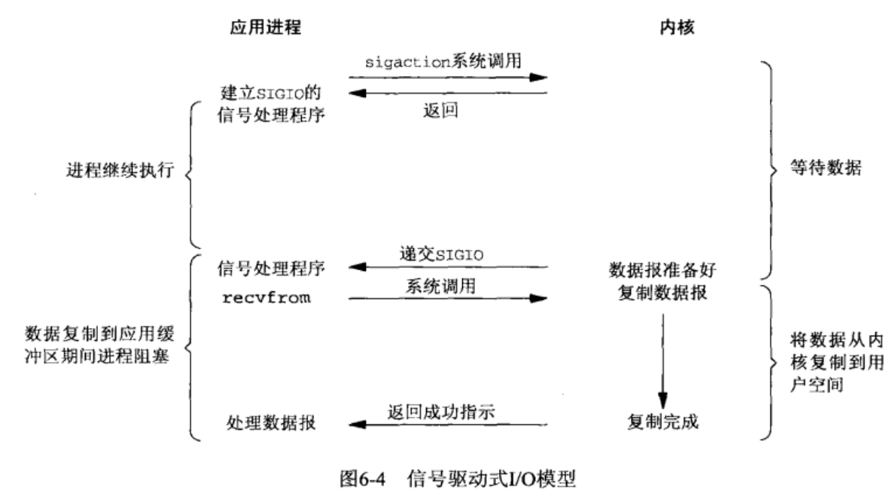
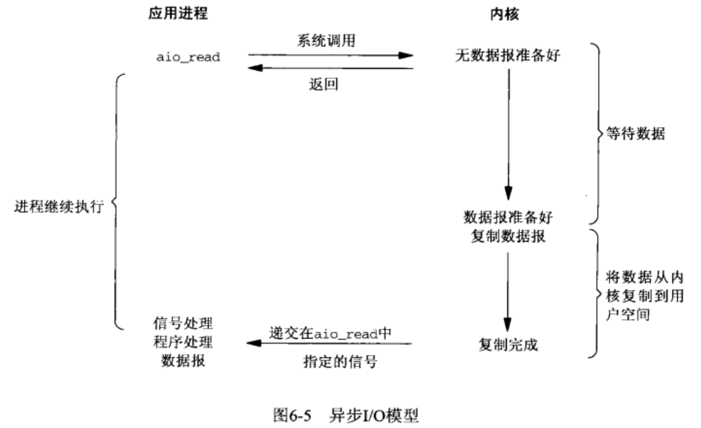

## 标准IO

## 文件IO

## 终端IO

## 高级IO




### 非阻塞IO




### IO多路复用



#### select

传给`select`的参数告诉内核：

- 我们关心的描述符
- 对于每个文件描述符关心的条件（读，写，异常）
- 愿意等多久
- 已经准备好的描述符总数量
- 对于读，写，异常这3个条件的每一个，哪些已经准备好

```c
#include <sys/select.h>
/*
 * param maxfdp1 监测最大个数
 * return < 0:出错
          > 0:有事件产生
          = 0:超时
 */
int select (int maxfdp1, fd_set * readfds,
            fd_set * writefds,
            fd_set * rxceptfds,
            struct timeval * tvptr);
   /* select 可能有一个或者多个事件产生，集合中除已发生事件外，将被清空 */         
```

- `tvptr == NULL` 永远等待
- `tvptr->tv_sec == 0 && tv_ptr->usec == 0` : 不等待
- 'tvptr->tv_sec != 0 || tvptr->tv_user != 0 ' 等待指定的秒数或者微妙数 

 ```c
/* 若 fd 在描述符集中 返回非0 */
int FD_ISSET(int fd, fd_set *fdset);

void FD_SET(int fd, fd_set *fdset);
void FD_CLR(int fd, fd_set *fdset);
void FD_ZERO(fd_set *fdset);
 ```


#### poll

```c
#include <poll.h>
struct polled {
    int fd;      /* 文件描述符 */
    short events;/* 监测的事件 */
    short revents; /* 产生的事件 */
};

/** 
 * param timeout -1: 永远等待
 *                0: 不等待
 *               >0: 毫秒
 */
int poll(struct pollfd fdarray[], nfds_t nfds, int timeout)
```

 `poll`类似`select`，但是`poll` 用于任何类型的文件描述符。不为每个条件（读，写，异常）构造一个描述符集，而是构造了一个`polled`结构的数组，每个数组元素指定一个描述符以及我们感兴趣的条件

| 标志名     | events | revents | 说明                                                         |
| ---------- | ------ | ------- | ------------------------------------------------------------ |
| POLLIN     | *      | *       | 可以不阻塞的读高优先级数据以外的数据（等效于 POLLRDNORM\|POLLRDBAND） |
| POLLRDNORM | *      | *       | 可以不阻塞的读普通数据                                       |
| POLLRDBAND | *      | *       | 可以不阻塞的读优先级数据                                     |
| POLLPRI    | *      | *       | 可以不阻塞的读高优先级数据                                   |
| POLLOUT    | *      | *       | 可以不阻塞的写普通数据                                       |
| POLLWRNORM | *      | *       | 与POLLOUT仙童                                                |
| POLLWRBAND | *      | *       | 可以不阻塞的写优先级数据                                     |
| POLLERR    |        | *       | 已出错                                                       |
| POLLHUP    |        | *       | 已挂断                                                       |
| POLLNVAL   |        | *       | 描述符没有引用一个打开文件                                   |


#### epoll

### 信号驱动IO




### 异步IO



